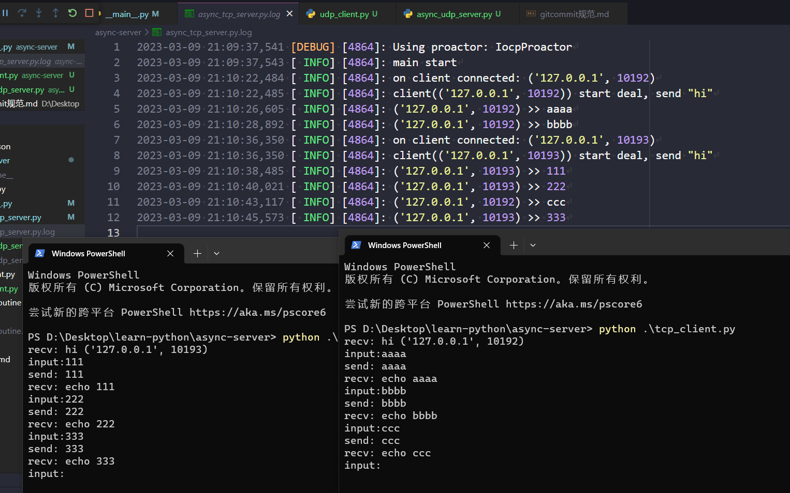
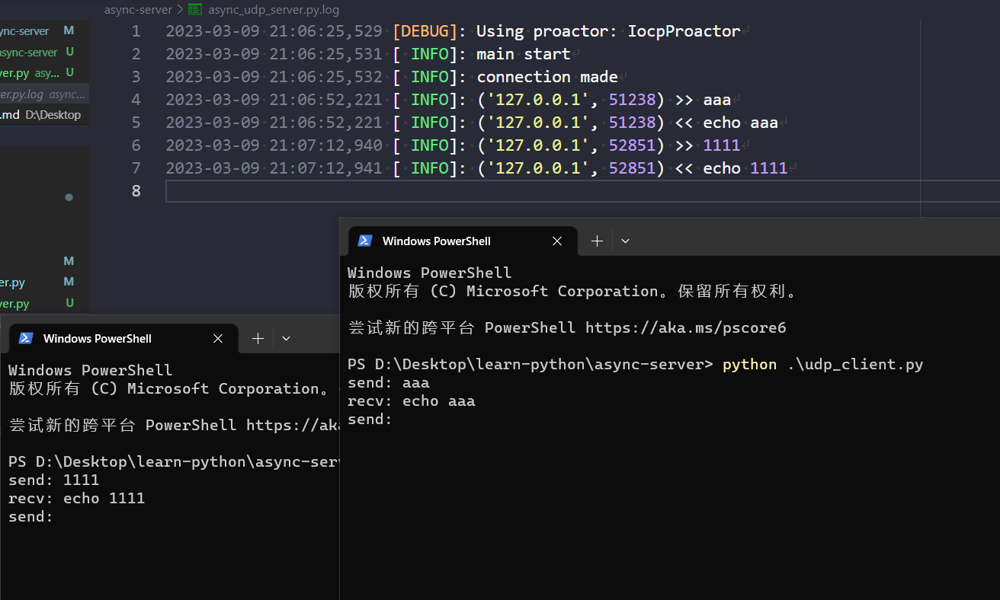

# learn-python

学习Python Web后端开发的一些记录

## 协程 coroutine

在Python中若希望利用多核性能可以使用多进程, 由于GIL全局锁Python的多线程无法发挥多核性能, 而且对于IO密集型的应用场景(比如Web), 进程和线程都不能过多的创建, 此时协程Coroutine就是一个非常棒的选择, 为每一个用户连接创建一个协程, 可以在单个线程中高效率异步处理多个IO请求

## 基于协程的服务器

asyncio库提供了async/await原语, 用于创建协程, 等待协程运行, 在事件循环中实现自动调度

asyncio库也提供了基于协程的异步网络支持

这里分别测试了基于协程的异步TCP/UDP回显服务器, 源码见 [async_tcp_server.py](./async-server/async_tcp_server.py) 以及 [async_udp_server.py](./async-server/async_udp_server.py)

测试截图:

